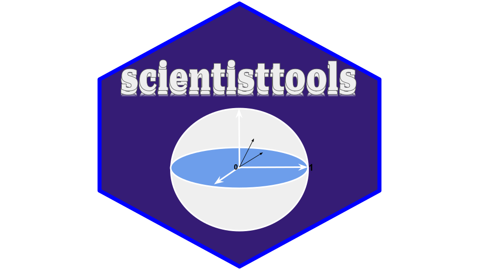
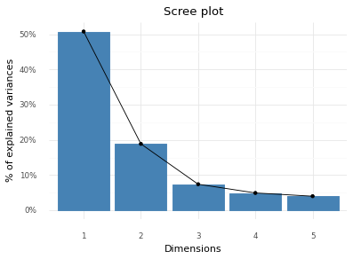
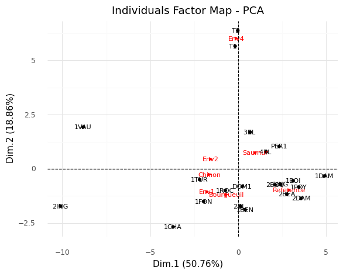

<center>
    
</center>

[](https://pepy.tech/project/scientisttools)


# scientisttools : Exploratory Multivariate Data Analysis with Python

scientisttools is a python package dedicated to multivariate Exploratory Data Analysis, clustering analysis and multidimensional scaling.

## Why use scientisttools?

scientisttools provides functions for :

1. **Generalized Factor Analysis (GFA) :** 
    * Principal Component Analysis (PCA)
    * Principal Component Analysis with partial correlation matrix (PartialPCA)
    * Exploratory Factor Analysis (EFA)
    * Correspondence Analysis (CA)
    * Multiple Correspondence Analysis (MCA)
    * Specific Multiple Correspondence Analysis (SpecificMCA)
    * Factor Analysis of Mixed Data (FAMD)
    * Mixed Principal Component Analysis (MPCA)
    * Principal Component Analysis of Mixed Data (PCAMIX)
    * Canonical Correlation Analysis (CCA)
    * Multiple Factor Analysis (MFA)
    * Multiple Factor Analysis for qualitatives/categoricals variables (MFAQUAL)
    * Multiple Factor Analysis of Mixed Data (MFAMD)
    * Multiple Factor Analysis of Mixed group (MFAMIX)
    * Multiple Factor Analysis of Contingence Tables (MFACT)

2. **Classification - clustering :**
    * Hierarchical Clustering on Principal Component (HCPC)
    * Variables Hierarchical Clustering Analysis (VARHCA)
    * Variables Hierarchical Clustering Analysis on Principal Components (VARHCPC)
    * Categorical Variables Hierarchical Clustering Analysis (CATVARHCA)

3. **Multidimensional scaling :**
    * Scaling by MAjorizing a COmplicated Function (SMACOF)
    * Classical Multidimensional Scaling (CMDSCALE)
    * Metric and Non - Metric Multidimensional Scaling (MDS)

4. In some methods, it allowed to add supplementary informations such as supplementary individuals and/or variables.
5. It provides a geometrical point of view, a lot of graphical outputs.
6. It provides efficient implementations, using a scikit-learn API.

Those statistical methods can be used in two ways :
* as descriptive methods ("datamining approach")
* as reduction methods in scikit-learn pipelines ("machine learning approach")

Notebooks are availabled.

## Installation

### Dependencies

scientisttools requires 

```python
Python >=3.10
numpy >=1.26.4
matplotlib >=3.8.4
scikit-learn >=1.2.2
pandas >=2.2.2
polars >=0.19.2
mapply >=0.1.21
plotnine >=0.10.1
pingouin >=0.5.4
scientistmetrics >=0.0.4
```

### User installation

You can install scientisttools using pip :

```python
pip install scientisttools
```

Tutorials are available

## Examples : Principal component analysis

1. **Loading data**

```python
# Load wine dataset
>>> from scientisttools import load_wine
>>> wine = load_wine()
>>> wine.info()
```
```
<class 'pandas.core.frame.DataFrame'>
Index: 21 entries, 2EL  to T2  
Data columns (total 31 columns):
 #   Column                         Non-Null Count  Dtype   
---  ------                         --------------  -----   
 0   Label                          21 non-null     category
 1   Soil                           21 non-null     category
 2   Odor.Intensity.before.shaking  21 non-null     float64 
 3   Aroma.quality.before.shaking   21 non-null     float64 
 4   Fruity.before.shaking          21 non-null     float64 
 5   Flower.before.shaking          21 non-null     float64 
 6   Spice.before.shaking           21 non-null     float64 
 7   Visual.intensity               21 non-null     float64 
 8   Nuance                         21 non-null     float64 
 9   Surface.feeling                21 non-null     float64 
 10  Odor.Intensity                 21 non-null     float64 
 11  Quality.of.odour               21 non-null     float64 
 12  Fruity                         21 non-null     float64 
 13  Flower                         21 non-null     float64 
 14  Spice                          21 non-null     float64 
 15  Plante                         21 non-null     float64 
 16  Phenolic                       21 non-null     float64 
 17  Aroma.intensity                21 non-null     float64 
 18  Aroma.persistency              21 non-null     float64 
 19  Aroma.quality                  21 non-null     float64 
 20  Attack.intensity               21 non-null     float64 
 21  Acidity                        21 non-null     float64 
 22  Astringency                    21 non-null     float64 
 23  Alcohol                        21 non-null     float64 
 24  Balance                        21 non-null     float64 
 25  Smooth                         21 non-null     float64 
 26  Bitterness                     21 non-null     float64 
 27  Intensity                      21 non-null     float64 
 28  Harmony                        21 non-null     float64 
 29  Overall.quality                21 non-null     float64 
 30  Typical                        21 non-null     float64 
dtypes: category(2), float64(29)
memory usage: 5.3+ KB
```


2. **Principal component analysis**

```python
>>> from scientisttools import PCA
>>> res_pca = PCA(standardize=True,n_components=5,ind_sup=list(range(15,21)),quanti_sup=[29,30],quali_sup=[0,1],parallelize=True)
>>> res_pca.fit(wine)
```

3. **Extract and visualize eigenvalues/varainces:**

```python
>>> from scientisttools import get_eig
>>> eig = get_eig(res_pca)
>>> eig.head(6)
```

```
	eigenvalue	difference	proportion	cumulative
Dim.1	14.740851	11.804968	54.595746	54.595746
Dim.2	2.935884	0.644286	10.873643	65.469389
Dim.3	2.291597	0.569027	8.487397	73.956786
Dim.4	1.722570	0.178368	6.379889	80.336675
Dim.5	1.544202	0.439988	5.719266	86.055941
Dim.6	1.104214	0.355298	4.089681	90.145621
```

```python
>>> from scientisttools import fviz_screeplot
>>> print(fviz_screeplot(res_pca))
```
<center>
    
</center>

4. **Extract and visualize results for individuals**

```python
>>> # Extract the results for individuals
>>> from scientisttools import get_pca_ind
>>> ind = get_pca_ind(res_pca)
>>> ind.keys()
```

```
dict_keys(['coord', 'cos2', 'contrib', 'infos'])
```

```python
>>> # Factor coordinates for individuals
>>> ind["coord"].head(6)
```
```
           Dim.1	  Dim.2	     Dim.3	    Dim.4	    Dim.5
2EL	   -0.697060  -2.852968	  0.169384	 0.942456	 0.957457
1CHA   -4.802838  -4.236054	 -0.969634	 0.164637	 0.288523
1FON   -2.577287  -0.184102	 -1.879038	-2.541729	-0.390677
1VAU  -10.582720   2.180724	  1.691468	-0.624785	 0.968510
1DAM	4.906159   0.147573	  0.864068	-0.138473	 2.525392
2BOU	1.746737   0.926421	 -1.281174	-1.113625	-1.805437
```

```python
>>> # Individuals factor map
>>> from scientisttools import fviz_pca_ind
>>> print(fviz_pca_ind(res_pca))
```

<center>
    
</center>


## Author(s)

Duvérier DJIFACK ZEBAZE ([djifacklab@gmail.com](djifacklab@gmail.com))
