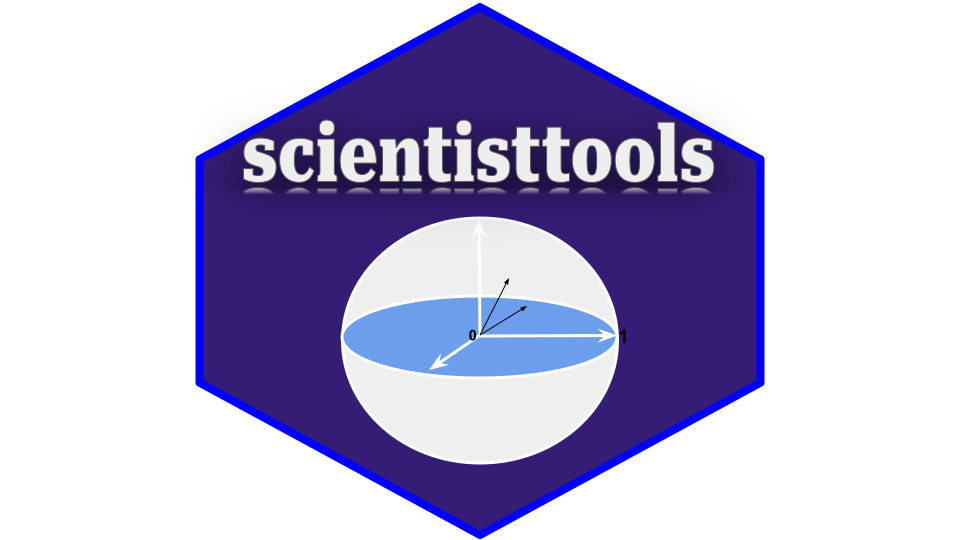
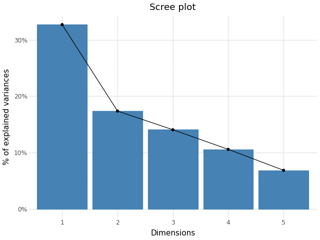
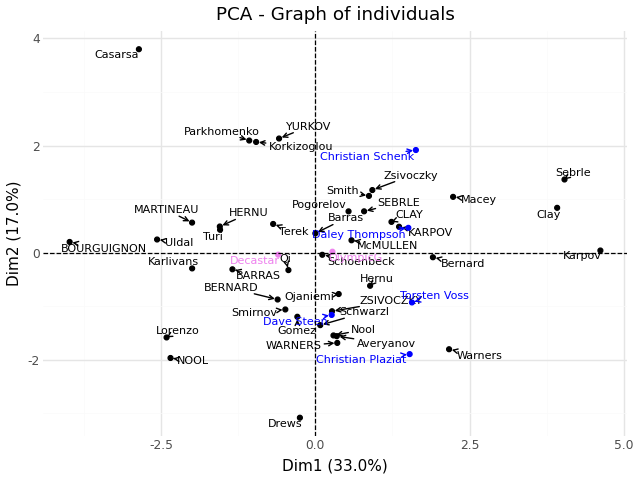

<p align="center">
    </img>
</p>

<div align="center">

[](https://github.com/enfantbenidedieu/scientisttools/blob/master/LICENSE)
[](https://pypi.org/project/scientisttools/)
[](https://pepy.tech/project/scientisttools)
[](https://pepy.tech/project/scientisttools)
[](https://pepy.tech/project/scientisttools)

</div>

# scientisttools : Multivariate Exploratory Data Analysis with Python

# Contents

**1. [Overview](#overview)**

**2. [Installation](#installation)**

* [2.1 Global environmen](#genv)
* [2.2 Virtual environment](#venv)
* [2.3 Version](#version)
* [2.4 Dependencies](#dependencies)

**3. [Example](#example)**

**4. [Documentation](#doc)**

**5. [About us](#about_us)**

* [5.1 Authors](#authors)
* [5.2 Feedbacks](#authors)
* [5.3 Citing scientisttools](#citing)

## Overview <a name="overview"></a>

scientisttools is a python package dedicated to multivariate exploratory data analysis, clustering analysis and multidimensional scaling.

scientisttools provides functions for :

1. **Generalized Factor Analysis (GFA) :** 

    1. **One table**

        * Correspondence Analysis (CA) and its derivatives (DCA, nsCA, CAiv, CAoiv, bcCA, wcCA)
        * Factor Analysis (FA)
            * Iterative and Non Iterative Principal Factor Analysis
            * Harris Component Analysis
        * Factor Analysis of Mixed Data (FAMD)
        * Varimax rotation in Factor Analysis (FArot)
        * Multiple Correspondenca Analysis (MCA) and its derivatives (speMCA, MCAiv, MCAoiv, bcMCA, wcMCA)
        * Mixed Principal Component Analysis (MPCA)
        * Principal Component Analysis (PCA) and its derivatives (Partial PCA, PCAiv, PCAoiv, bcPCA, wcPCA)
        * Principal Component Analysis of Mixed Data (PCAmix) and its derivatives (PCAmixiv, PCAmixoiv, bcPCAmix, wcPCAmix)
        * Varimax rotation in Principal Component Analysis (PCArot)

    2. **Two tables**

        * Between-class/Within-class Analysis (BWCA)
        * Canonical Correlation Analysis (CANCORR)
        * Canonical Correspondence Analysis (CCA)
        * CO-Inertia Analysis (COIA)
        * Principal Component Analysis with (orthogonal) instrumental variables (PCAiv)
        * Procrustes Analysis (Procrustes)

    3. **Multi tables**

        * Between Group Comparison (BGC)
        * Dual Common Component and Specific Weights Analysis (DCCSWA)
        * Dual Generalized Procrustean Analysis (DGPA)
        * Analysis of Multiple Distance Matrices (DISTATIS)
        * Dual Multiple Factor Analysis (DMFA)
        * Dual Statis (DSTATIS)
        * Flury's Common Principal Component Analysis (FCPCA)
        * Internal Correspondence Analysis (ICA)
        * Multiple CO-Inertia Analysis (MCOIA)
        * Multiple Factor Analysis (MFA)
        * Multiple-group Principal Component Analysis (mgPCA)
        * Structuration de Tableaux A Trois Indices de la Statistique (STATIS)

2. **Classification - clustering :**
    * Categorical Variables Hierachical Clustering on Principal Components (CatVARHCPC)
    * Categorical Variables K-Means clustering on Principal Components (CatVARKMeansPC)
    * Hierarchical Clustering on Principal Component (HCPC)
    * K-Means Clustering on Principal Components (KMeansPC)
    * Variables Agglomerative Hierachical Clustering on Principal Components (VARHCPC)
    * Variables K-Means Clustering on Principal Components (VARKMeansPC)
    
3. **Multidimensional scaling :**
    * Principal Coordinates Analysis (PCoA)

4. In some methods, it allowed to add supplementary informations such as supplementary individuals and/or variables.
5. It provides a geometrical point of view, a lot of graphical outputs.
6. It provides efficient implementations, using a scikit-learn API.

Those statistical methods can be used in two ways :
* as descriptive methods ("datamining approach")
* as reduction methods in scikit-learn pipelines ("machine learning approach")

## Installation <a name="installation"></a>

### Global environment <a name="genv"></a>

You can directly install scientisttools using pip :

```bash
pip install scientisttools
```

or set a virtual environment.

### Virtual environment <a name="venv"></a>

Install the 64-bit version of Python 3, for instance from the [official website](https://www.python.org/). Now create a [virtual environment (venv)](https://docs.python.org/3/tutorial/venv.html) and install scientisttools.

The virtual environment is optional but strongly recommended, in order to avoid potential conflicts with other packages.

```bash
PS C:\> python -m venv scientisttools-env # create virtual env
PS C:\> scientisttools-env\Scripts\activate  # activate
PS C:\> pip install -U scientisttools  # install scientisttools
```

### Version <a name="version"></a>

In order to check your installation, you can use.

```python
>>> import scientisttools
>>> print(scientisttools.__version__)
0.2.0
```

Using an isolated environment such as *pip venv* or *conda* makes it possible to install a specific version of scientisttools with pip and conda and its dependencies independently of any previously installed Python packages.

You should always remember to activate the environment of your choice prior to running any Python command whenever you start a new terminal session.

### Dependencies <a name="dependencies"></a>

scientisttools is compatible with python version which supports both dependencies :

| Packages          |  Version |
| :---------------- | :------: |


## Example <a name="example"></a>

1. **Loading data**

```python
>>> from scientisttools.datasets import decathlon
>>> data = decathlon.data
```

2. **Principal component analysis**

```python
>>> from scientisttools import PCA
>>> clf = PCA(ind_sup=range(41,46),sup_var=(10,11,12))
>>> clf.fit(data)
PCA(ncp=2,ind_sup=range(41,46),sup_var=(10,11,12))
```

3. **Visualize eigenvalues/varainces:**

```python
>>> from scientisttools import fviz_screeplot
>>> print(fviz_screeplot(clf))
```
<center>
    
</center>

4. **Extract and visualize results for individuals**

```python
>>> # extract the results for individuals
>>> from scientisttools import get_pca_ind
>>> ind = get_pca_ind(clf)
>>> ind._fields
... ('coord', 'cos2', 'contrib', 'infos')
```

```python
>>> # Individuals factor map
>>> from scientisttools import fviz_pca_ind
>>> p = fviz_pca_ind(clf)
>>> print(p.show())
```

<center>
    
</center>

## Documentation <a name="doc"></a>

The official documentation is hosted on [https://scientisttools.readthedocs.io](https://scientisttools.readthedocs.io).

## About Us <a name="about_us"></a>

### Authors <a name="authors"></a>

scientisttools is developed and maintained by [Duvérier DJIFACK ZEBAZE](https://www.linkedin.com/in/duv%C3%A9rier-djifack-z-030097118/), the founder 
of djifacklab (*Djifack Laboratory of Mathematics, Statistics and Economics books and packages production using Python Programming Language*).

The djifacklab laboratory maintains others python librairies such as [discrimintools](https://pypi.org/project/discrimintools/), [scientistmetrics](https://pypi.org/project/scientistmetrics/), [scientistshiny](https://pypi.org/project/scientistshiny/), [scientisttseries](https://pypi.org/project/scientistshiny/) and [ggcorrplot]( https://pypi.org/project/ggcorrplot/).

### Feedbacks <a name="feedbacks"></a>

If you have found scientisttools useful in your work, research, or company, please let us know by writing to email [djifacklab@gmail.com](mailto:djifacklab@gmail.com).

### Citing scientisttools <a name="citing"></a>

If scientisttools has been significant in your research, and you would like to acknowledge the project in your academic publication, we suggest citing it using the following *BibTeX format*:

```
@misc{DJIFACK ZEBAZE_2023, 
    url = {https://github.com/enfantbenidedieu/scientisttools}, 
    title = {scientisttools: Multivariate Exploratory Data Analysis with Python}
    author = {DJIFACK ZEBAZE, Duvérier}, 
    year = {2023}
}
``` 