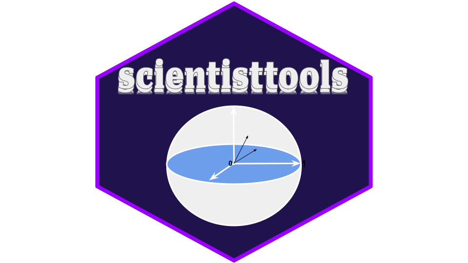

<center>
    
</center>

# scientisttools : Exploratory Multivariate Data Analysis with Python

scientisttools is a python package dedicated to multivariate Exploratory Data Analysis, clustering analysis and multidimensional scaling.

## Why use scientisttools?

* It performs classical principal component methods : 
    * Principal Components Analysis (PCA)
    * Principal Components Analysis with partial correlation matrix (PartialPCA)
    * Exploratory Factor Analysis (EFA)
    * Correspondence Analysis (CA)
    * Multiple Correspondence Analysis (MCA)
    * Specific Multiple Correspondence Analysis (SpecificMCA)
    * Factor Analysis of Mixed Data (FAMD)
    * Principal Components Analysis of Mixed Data (PCAMIX)
    * Canonical Correlation Analysis (CCA)
    * Multiple Factor Analysis (MFA)
    * Multiple Factor Analysis for qualitatives/categoricals variables (MFAQUAL)
    * Multiple Factor Analysis of Mixed Data (MFAMIX)
    * Multiple Factor Analysis of Contingence Tables (MFACT)

* It also performs clustering analysis:
    * Hierarchical Clustering on Principal Components (HCPC)
    * Variables Hierarchical Clustering Analysis (VARHCA)
    * Variables Hierarchical Clustering Analysis on Principal Components (VARHCPC)
    * Categorical Variables Hierarchical Clustering Analysis (CATVARHCA)

* And Multidimensional scaling:
    * Scaling by MAjorizing a COmplicated Function (SMACOF)
    * Classical Multidimensional Scaling (CMDSCALE)
    * Metric and Non - Metric Multidimensional Scaling (MDS)
    

* In some methods, it allowed to add supplementary informations such as supplementary individuals and/or variables.
* It provides a geometrical point of view, a lot of graphical outputs.
* It provides efficient implementations, using a scikit-learn API.

Those statistical methods can be used in two ways :
* as descriptive methods ("datamining approach")
* as reduction methods in scikit-learn pipelines ("machine learning approach")


Notebooks are availabled.

## Installation

### Dependencies

scientisttools requires 

```
Python >=3.10
numpy >=1.26.4
matplotlib >=3.8.4
scikit-learn >=1.2.2
pandas >=2.2.2
polars >=0.19.2
mapply >=0.1.21
plotnine >=0.10.1
pingouin >=0.5.4
scientistmetrics >=0.0.4
```

### User installation

You can install scientisttools using `pip` :

```
pip install scientisttools
```

Tutorial are available

## Author

Duvérier DJIFACK ZEBAZE ([duverierdjifack@gmail.com](duverierdjifack@gmail.com))
